<!-- ========================================================== -->
<!--                      HERO BANNER SECTION                   -->
<!-- ========================================================== -->

  

<!-- Animated Typing Effect -->

  

<!-- Social Badges -->

  &nbsp;&nbsp;
  &nbsp;&nbsp;
  

<!-- Profile Views Counter -->

  

  

<!-- ========================================================== -->
<!--                         ABOUT ME                           -->
<!-- ========================================================== -->
## 🧑‍💻 Profile

I am a detail-driven **Frontend Engineer** specializing in engineering premium, accessible, and performant user interfaces. With a strong eye for design systems and clean layouts, I build modern web applications using **React**, **Next.js**, and **TypeScript**, integrating seamlessly with backend services like **Supabase**. 

I focus on clean code, responsive layouts, and smooth animations, while maintaining high performance and SEO visibility. Certified by Meta in Frontend Engineering and Google in AI development.

 

<!-- ========================================================== -->
<!--                       FEATURED PROJECTS                    -->
<!-- ========================================================== -->
## 📁 Featured Projects

A selection of my strongest public repositories, ranked by quality, complexity, and styling.

#### 🌟 [AURA](https://github.com/EngSalahKhaled/aura-brand) — Enterprise Luxury Fashion Platform
> **A comprehensive, enterprise-grade luxury fashion e-commerce platform unifying a premium storefront with a full internal ERP & Admin Dashboard.**
- **Stack:** Next.js 14 • TypeScript • Tailwind CSS • Supabase (PostgreSQL) • Framer Motion • DOMPurify
- **Highlight:** Features a headless CMS website manager, role-based access control (RBAC), full RTL Arabic localization, real-time inventory alerts, and dynamic SEO (sitemaps + OpenGraph).
- **Resources:** [Live Demo](https://aura-brand-virid.vercel.app/) • [Repository](https://github.com/EngSalahKhaled/aura-brand)

#### ⚡ [Copra-Dashboard](https://github.com/EngSalahKhaled/Copra-Dashboard)
> **A premium, high-performance admin dashboard featuring a cyberpunk dark-mode glassmorphic aesthetic.**
- **Stack:** HTML5 • CSS3 (Vanilla Glassmorphism) • JavaScript (ES6) • Supabase (Auth & Database) • PLpgSQL
- **Highlight:** Fully integrated user authentication and database operations utilizing Supabase.
- **Resources:** [Live Demo](https://copra-dashboard.vercel.app) • [Repository](https://github.com/EngSalahKhaled/Copra-Dashboard)

#### 🚀 [Mashhour-Hub](https://github.com/EngSalahKhaled/Mashhour-Hub-)
> **A specialized platform hub designed for content creators and influencers, optimizing link aggregation and presentation.**
- **Stack:** HTML5 • CSS3 • JavaScript (ES6) • Responsive Design
- **Highlight:** Streamlined navigation and layout engineered for high-performance mobile viewport traffic.
- **Resources:** [Repository](https://github.com/EngSalahKhaled/Mashhour-Hub-)

#### 🎮 [NeonTech-Gaming-Store](https://github.com/EngSalahKhaled/NeonTech-Gaming--Store)
> **Premium gaming e-commerce platform with a rich catalog and real-time WhatsApp checkout routing.**
- **Stack:** HTML5 • CSS3 • JavaScript • WhatsApp Checkout Integration • Supabase Auth
- **Highlight:** Dynamic cart management and seamless checkout flow supporting over 70 gaming products.
- **Resources:** [Repository](https://github.com/EngSalahKhaled/NeonTech-Gaming--Store)

#### 📰 [Ui-UX-Landing-Page](https://github.com/EngSalahKhaled/Ui-UX-Landing-Page-)
> **A pixel-perfect clone of 'The UX Review' blog utilizing Neo-Brutalist layout styles.**
- **Stack:** HTML5 • CSS3 (High Contrast / Grid System)
- **Highlight:** Handcrafted responsive layout resolving complex typography grids and border styling without templates.
- **Resources:** [Repository](https://github.com/EngSalahKhaled/Ui-UX-Landing-Page-)

  

<!-- ========================================================== -->
<!--                        TECH STACK                          -->
<!-- ========================================================== -->
## 🛠️ Technical Stack

I use a curated set of tools and technologies to build scalable, high-performance web applications:

<table>
  <tr>
    <td width="25%"><strong>Core Frontend</strong></td>
    <td>React, Next.js, HTML5, CSS3, Tailwind CSS, Framer Motion</td>
  </tr>
  <tr>
    <td width="25%"><strong>Languages</strong></td>
    <td>JavaScript (ES6+), TypeScript, SQL (PostgreSQL)</td>
  </tr>
  <tr>
    <td width="25%"><strong>Backend &amp; DB</strong></td>
    <td>Node.js, Express, Supabase (PostgreSQL, PLpgSQL)</td>
  </tr>
  <tr>
    <td width="25%"><strong>Developer Tools</strong></td>
    <td>Git, GitHub Actions, VS Code, Vercel</td>
  </tr>
</table>

 

<!-- ========================================================== -->
<!--                     CREDENTIALS / CERTS                    -->
<!-- ========================================================== -->
## 🏆 Certifications

- 🏷️ **Meta Certified Frontend Developer**
- 🏷️ **Google AI Essentials**
- 🏷️ **Gemini Student Ambassador / Certified Student**

  

<!-- ========================================================== -->
<!--                      CURRENT FOCUS                         -->
<!-- ========================================================== -->
## 🎯 Current Focus

- 🚀 **Currently Building:** E-commerce solutions, dashboard interfaces, and premium animated design layouts.
- 📚 **Currently Learning:** Next.js Server Components, Server-Side Rendering patterns, and Advanced Web APIs.
- 🌐 **Open Source Goals:** Contributing to accessible UI components and reusable design utilities.

  

<!-- ========================================================== -->
<!--                     GITHUB ANALYTICS                       -->
<!-- ========================================================== -->
## 📊 GitHub Analytics

These charts automatically track my active repositories and coding metrics.

  
  

  

 

<!-- ========================================================== -->
<!--                     SNAKE CONTRIBUTION                     -->
<!-- ========================================================== -->
## 🐍 Contribution Activity

This snake animates based on daily commit history. It runs via a GitHub Actions cron job.

<picture>
  <source media="(prefers-color-scheme: dark)" srcset="https://raw.githubusercontent.com/EngSalahKhaled/EngSalahKhaled/output/github-contribution-grid-snake-neon.svg" />
  <source media="(prefers-color-scheme: light)" srcset="https://raw.githubusercontent.com/EngSalahKhaled/EngSalahKhaled/output/github-contribution-grid-snake.svg" />
  
</picture>

  

<!-- ========================================================== -->
<!--                        FOOTER BRADING                      -->
<!-- ========================================================== -->

  

